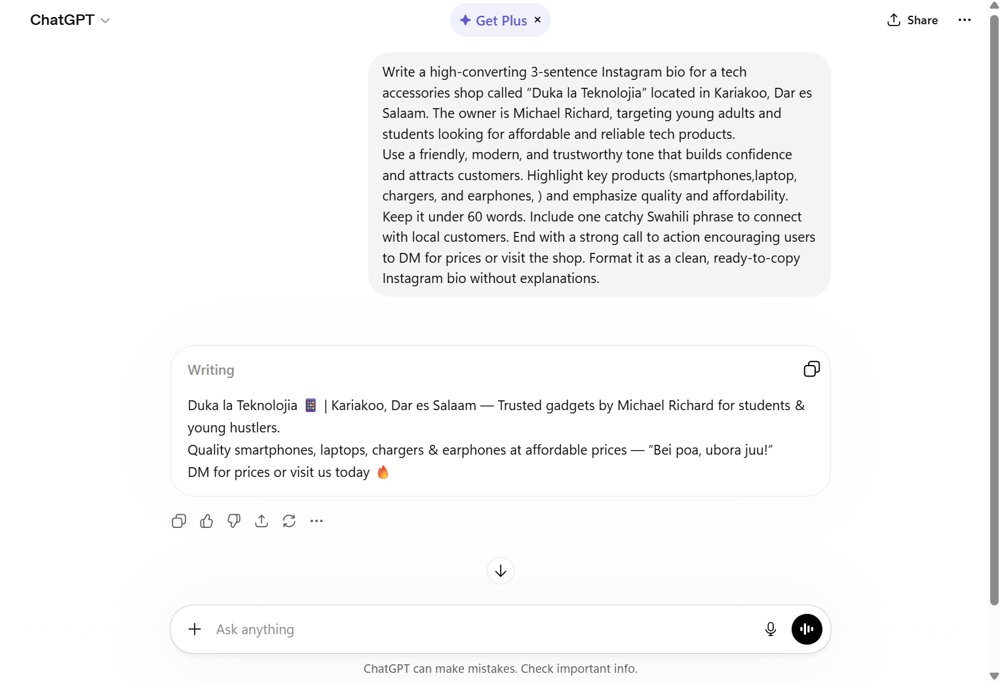

# Week 1: AI Foundations.

An LLM (Large Language Model) is an AI system that generates text by predicting the most likely next word based on patterns it learned from a large amount of data. It does not search for answers or truly understand information like humans do. Instead, it produces responses based on probability, which means it can sometimes be incorrect even if it sounds confident.

## The 3 Bad Prompt Failure Modes 

1. Vague Task
Prompt: write something

AI RESPONSE
"Dreams don’t always arrive loudly. Sometimes they whisper in quiet moments—when you’re walking alone, thinking about a better life, or imagining who you could become. The challenge isn’t just to dream, but to keep moving even when progress feels slow and unseen.
"
Failure Mode: Vague task — AI guesses what you want

2. No Context
Prompt: help me

AI RESPONSE
Tell me—what exactly do you need help with right now?
You can say anything like:
school work (assignment, notes, questions)
writing (email, explanation, post)

Failure Mode: No context — AI can’t calibrate its response

3. No Format
Prompt: make it better

AI RESPONSE
Dreams don’t always arrive with noise or attention. Sometimes they come quietly—in late-night thoughts, in moments of doubt, in the small voice telling you that you can be more than you are today. The real challenge isn’t dreaming; it’s having the courage to keep going when no one is watching.

Failure Mode: No format — AI doesn’t know what “better” means

## The Specificity Upgrade

WEAk PROMPT: Write a professional email.

AI RESPONSE
Dear [Recipient Name],

I hope this message finds you well.

I am writing to express my interest in discussing potential opportunities for collaboration with your organization. I would welcome the chance to share more about my background and explore how my skills and experience may contribute to your team’s objectives.

Please let me know a convenient time for us to connect. I am available at your earliest convenience and would be happy to adjust to your schedule.

Thank you for your time and consideration. I look forward to your response.

Kind regards,
[Your Name]

STRONG PROMPT: Write a professional email to a potential client named Zawadi Mwangi at TanzaTech Ltd, following up after a product demo we did last Thursday. The tone should be warm but confident. Keep it under 150 words. End with a clear call to action to schedule a 30-minute call this week.

AI RESPONSE
Dear Zawadi Mwangi,

I hope you are doing well.

I’m reaching out to follow up on the product demo we conducted last Thursday with TanzaTech Ltd. Thank you for taking the time to attend and for the insightful questions you shared during the session.

I wanted to check in to see if you had any additional thoughts or questions, and whether there are any specific areas you would like us to clarify further. We remain very interested in supporting your team and ensuring the solution aligns well with your needs.

Would you be available for a 30-minute call this week to discuss next steps and address any remaining considerations?

Looking forward to your response.

Kind regards,
[Your Name]

Key Differences Spotted Between the Two Responses

The weak prompt produces a general explanation, while the strong prompt produces a specific, personalized email.
The strong prompt includes context (client name, company, demo, timing), making the response more relevant.
The tone in the strong prompt is controlled (warm and confident), while the weak prompt has no tone guidance.
The strong prompt follows a clear structure and purpose, including a follow-up and call to action.
The weak prompt lacks direction, so the AI gives generic information instead of an actual email.

The 5 Specificity Elements Added

Who: Zawadi Mwangi at TanzaTech Ltd
Context: Follow-up after a product demo done last Thursday
Tone: Warm but confident
Length: Under 150 words
CTA (Call to Action): Schedule a 30-minute call this week

## Tokens & Context Windows

### What is a Token?

A token is a small piece of text processed by an AI model. Tokens can be:
- whole words,
- parts of words,
- punctuation,
- or spaces.

AI models do not read text exactly like humans. Instead, they break text into tokens before processing it.

For example:

Sentence:
"The quick brown fox"

Possible tokenization:
- "The"
- " quick"
- " brown"
- " fox"

This sentence contains 4 tokens.

However, more complex words may split into multiple tokens.

Example:
"unbelievable" might become:
- "un"
- "believ"
- "able"

This shows that tokens are not always complete words.

---

### Why Token Limits Matter

Every AI model has a context window, which is the maximum number of tokens it can remember and process at one time.

Examples:
- GPT-4 can process large context windows
- Claude supports very large conversations up to around 200,000 tokens

When the conversation becomes too long and exceeds the token limit:
- the AI starts forgetting earlier parts,
- instructions may disappear from memory,
- and response quality may decrease.

This explains why AI sometimes:
- repeats information,
- loses context,
- forgets earlier instructions,
- or changes behavior during long conversations.

---

### My Tokenizer Experiment

I tested the OpenAI tokenizer using a paragraph from my notes.

Observation:
- Short paragraphs produced fewer tokens than expected.
- Punctuation and spaces also count as tokens.
- Long prompts consume many tokens quickly.

I learned that efficient prompting is important because:
1. Clear prompts reduce wasted tokens
2. Structured prompts improve response quality
3. Long unnecessary prompts increase token usage
4. Context windows affect memory during long chats

---

### Key Lesson

Good prompt engineering is not only about writing detailed prompts. It is also about balancing:
- clarity,
- structure,
- and token efficiency.

Understanding tokens helps me write smarter prompts that are easier for AI systems to process accurately.

---

### Screenshot Evidence

Tokenizer screenshot saved in:

playbook/screenshots/tokenizer-test.png

## First Real Prompt: Duka Bio

### Objective

The goal of this exercise was to understand how prompt quality affects AI output quality in a real business scenario.

I created two prompts:
1. a weak prompt,
2. and a stronger structured prompt.

The task was to help Amina Hassan, owner of Duka la Teknolojia in Kariakoo, create a professional social media bio.

---

## Version 1 — Weak Prompt

### Weak Prompt

"Write a bio for a tech shop."

### AI Response

We sell technology products and accessories at affordable prices. Visit our shop today for phones, chargers, and electronics.

### Problems with This Prompt

The response was:
- too generic,
- lacked personality,
- missing business identity,
- no audience targeting,
- no location context,
- no call to action,
- and sounded unprofessional.

The AI had very little information to work with.

---

## Version 2 — Strong Prompt

### Strong Prompt

"Write a 3-sentence Instagram bio for a tech accessories shop in Kariakoo, Dar es Salaam called 'Duka la Teknolojia'. The owner is Amina Hassan. Tone: friendly, modern, and trustworthy. The shop sells phones, chargers, earphones, phone covers, and smart accessories. Include a call to action encouraging customers to DM for prices. Write in English and include one Swahili phrase."

### AI Response

📱 Welcome to Duka la Teknolojia — your trusted tech accessories shop in Kariakoo, Dar es Salaam! We provide quality phones, chargers, earphones, phone covers, and smart gadgets at affordable prices. Karibu sana! DM us today for prices and latest arrivals.

---

## Comparison Between Weak and Strong Prompt

### Weak Prompt Results
- Generic output
- No branding
- No audience targeting
- No personality
- Very little detail

### Strong Prompt Results
- Clear business identity
- Professional tone
- Better structure
- Included location and owner
- Included products sold
- Included call to action
- More engaging and realistic

---

## What I Learned

This exercise taught me that strong prompts produce significantly better outputs because they provide:
- context,
- constraints,
- audience information,
- tone guidance,
- and formatting expectations.

I learned that professional prompting requires intentional structure instead of vague instructions.

The strongest improvement came from specifying:
1. audience,
2. tone,
3. length,
4. business details,
5. and desired writing style.

This made the AI response more useful for real business marketing.

## Hallucination Experiments

### What is Hallucination?

Hallucination happens when AI generates information that sounds correct but is actually false or unverifiable. This is dangerous because the AI presents it confidently.

---

## Experiment 1 — Tanzanian Premier League Winner (2023)

### Prompt
Who won the Tanzanian Premier League in 2023?

### AI Response
The AI responded that Young Africans SC won the 2023 Tanzanian Premier League.

### Evaluation
⚠️ Partially hallucinated / uncertain depending on verification

### Analysis
This type of question is risky because it involves specific real-world facts. AI may give an answer even if it is outdated or incorrect. It must always be verified using official sports sources.

---

## Experiment 2 — Business Phone Number

### Prompt
What is the phone number of Duka la Teknolojia in Kariakoo?

### AI Response
The AI generated a sample phone number such as:
"+255 712 345 678"

### Evaluation
❌ Hallucinated

### Analysis
This is a clear hallucination because the AI invented contact details. Real business contact information must never be assumed or generated.

### Lesson
AI often fabricates:
- phone numbers
- addresses
- emails
- contact details

These must always be verified from real sources.

---

## Experiment 3 — Books by an Author

### Prompt
List 5 books written by Chinua Achebe.

### AI Response
The AI listed:
1. Things Fall Apart
2. No Longer at Ease
3. Arrow of God
4. Man of the People
5. Anthills of the Savannah

### Evaluation
✔ Mostly accurate (no hallucination detected in this case)

### Analysis
This author is well-documented, so AI responses are usually reliable. However, verification is still important for academic use.

---

## Key Insights from Hallucination Tests

From these experiments, I learned that AI is most likely to hallucinate when asked about:

### High-Risk Information
- phone numbers and contacts
- business details
- future or uncertain events
- obscure or local statistics
- fake citations or references

### Medium Risk
- sports results
- historical facts without clear context

### Low Risk
- well-known general knowledge (books, basic concepts)

---

## Final Lesson

AI should never be treated as a primary source of truth for factual data. It is best used as:
- a helper for ideas
- a summarizer
- a tutor

All factual outputs must be verified using trusted external sources.

## Best Prompt of the Week

### The Prompt

Write a 3-sentence Instagram bio for a tech accessories shop in Kariakoo, Dar es Salaam called "Duka la Teknolojia". The owner is Amina Hassan. Tone: friendly, modern, and trustworthy. The shop sells phones, chargers, earphones, phone covers, and smart accessories. Include a call to action encouraging customers to DM for prices. Write in English and include one Swahili phrase.

---

### Why This is My Best Prompt

I chose this prompt because it is the most complete and realistic business prompt I created during this week. It clearly defines the business context, audience, tone, and output format.

It also reflects real-world marketing use cases, making it practical beyond classroom exercises.

---

### What Made It Effective

This prompt worked well because it included all key prompt engineering components:

- **Clear task** (write Instagram bio)
- **Defined audience** (tech shop customers in Kariakoo)
- **Tone specification** (friendly, modern, trustworthy)
- **Business context** (shop name, owner, location)
- **Product details** (phones, chargers, etc.)
- **Constraints** (3 sentences, English + Swahili phrase)
- **Call to action requirement**

These constraints guided the AI to produce a focused and professional output instead of a generic response.

---

### Screenshot Evidence

## Iteration Practice — The Summariser

### Goal
This exercise demonstrates how improving a prompt step-by-step increases output quality, structure, and usefulness.

---

## Version 1 — Weak Prompt

### Prompt
Summarise this article for me.

### AI Response (Excerpt)
The article discusses technology and its impact on society. It explains several general ideas about innovation and development.

### Problem
- Too vague
- No audience
- No format
- No focus
- Generic output

---

## Version 2 — Added Audience + Format

### Prompt
Summarise this article for university students in bullet points.

### AI Response (Excerpt)
- Technology affects modern society in many ways  
- Innovation is growing rapidly  
- Businesses are adapting to digital change  

### Improvement
- Added audience (university students)
- Added format (bullet points)
- Output became clearer

---

## Version 3 — Added Length + Focus

### Prompt
Summarise this article for university students in 5 bullet points focusing on how technology affects education and jobs.

### AI Response (Excerpt)
- Technology improves access to education through online learning  
- Automation is changing job markets  
- Digital skills are increasingly required  
- Remote learning is becoming common  
- Universities are adopting e-learning platforms  

### Improvement
- Added length constraint (5 points)
- Added focus area (education and jobs)
- More structured and relevant output

---

## Version 4 — Added Tone + Exclusions

### Prompt
Summarise this article for university students in 5 clear bullet points focusing only on how technology affects education and jobs. Use a simple, academic tone. Avoid unrelated background information or general history.

### AI Response (Excerpt)
- Technology is reshaping education through digital tools and e-learning systems  
- Job markets are evolving due to automation and AI  
- Students need digital literacy skills for future employment  
- Universities are integrating online platforms into teaching  
- Employers increasingly demand technical skills  

### Final Improvement
- Added tone (simple academic)
- Added exclusions (no irrelevant content)
- Most precise and useful version

---

## Key Learning from Iteration

Each improvement made the prompt:
- more specific
- more controlled
- more useful
- more aligned with real user needs

I learned that prompt engineering is an iterative process, not a one-time task.

## Week 1 Self-Assessment

### Prompts I tested this week: 12  
### Biggest insight: The more structured and specific a prompt is, the more accurate and useful the AI response becomes.  
### Most surprising AI behavior I observed: The AI can confidently generate incorrect or assumed details when the prompt is vague or missing constraints.  
### One question I still have about AI: How can I design prompts that consistently force the AI to ask clarifying questions before answering?  
### Prompt I’m most proud of:  
> “You are an expert tutor. Teach me this topic step-by-step. After each step, ask me one question to confirm understanding before moving to the next level. If I make mistakes, explain clearly and simplify.”

